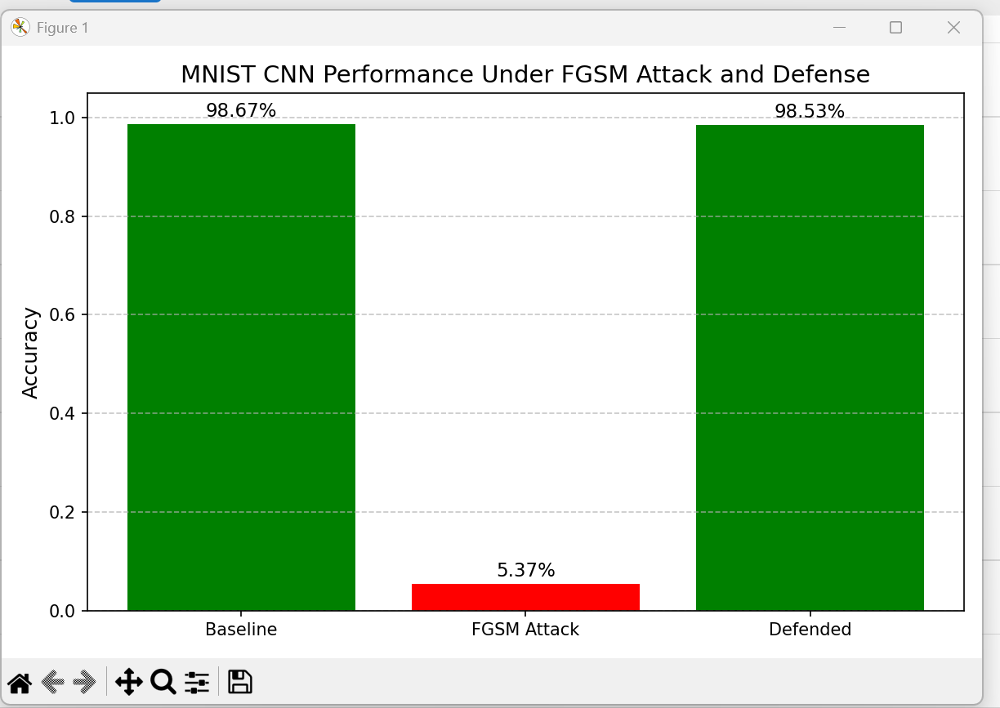

# AI Security Final Project

**Course:** CTEC450  
**Author:** Jeffery L Parker  
**Instructor:** Professor Carter

---

## 📌 Overview
This project demonstrates how machine learning models can be vulnerable to adversarial attacks and how defensive techniques can improve model robustness.

A Convolutional Neural Network (CNN) is trained on the MNIST dataset to classify handwritten digits. The model is then attacked using the Fast Gradient Sign Method (FGSM) and later defended using adversarial training.

---

## ⚙️ Technologies Used
- Python
- PyTorch
- Torchvision
- Matplotlib
- NumPy

---

## 🚀 How It Works

### 1. Baseline Model
- CNN trained on MNIST dataset
- Achieves high accuracy (~98%)

### 2. Adversarial Attack (FGSM)
- Small perturbations added to images
- Causes model to misclassify inputs
- Accuracy drops significantly

### 3. Defense (Adversarial Training)
- Model retrained using adversarial examples
- Improves robustness against attacks
- Accuracy restored to ~98%

---

## 📊 Results

| Stage            | Accuracy|
|------------------|---------|
| Baseline         | ~98%    |
| Under Attack     | ~3–6%   |
| After Defense    | ~98%    |

---

## 📈 Example Output

*(## 📈 Example Output

*

---

## ▶️ How to Run
1. Install dependencies:
2. Run the project: python ai_security_final_project.py
   
## 📌 Key Takeaway

Machine learning models are highly effective but vulnerable to adversarial attacks. Techniques like adversarial training are essential for building secure and reliable AI systems.
